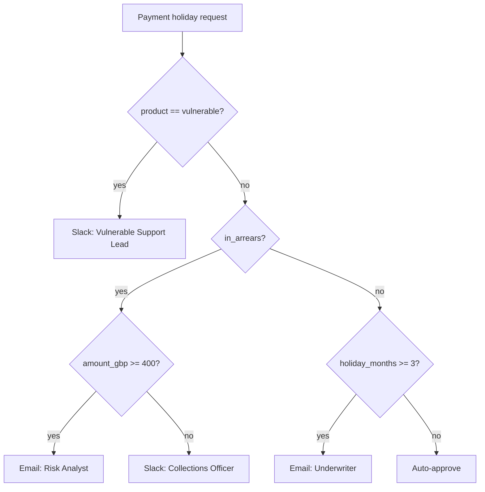

# Payment holiday approval workflow (take-home)

Northbridge Servicing is a fictional unsecured personal-loan servicer. When a borrower asks for a **payment holiday**, one configured workflow decides:

- **outcome:** auto-approve, or send for review
- **who** is asked, if anyone
- **channel:** email or Slack — both **mocked** (`print` / log is enough)

A request has only four fields:

| Field | Meaning |
|---|---|
| `amount_gbp` | Current monthly payment |
| `holiday_months` | 1–6 |
| `in_arrears` | Already missed at least one payment |
| `product` | `standard` or `vulnerable` |

Backend-only is a complete submission.

---

## Fig. 1 — workflow

Bounds on the diagram are **inclusive**: `amount_gbp >= 400`, `holiday_months >= 3`.



---

## Worked examples

```text
amount=250, months=2, in_arrears=false, product=standard
→ auto-approve, no notification

amount=500, months=1, in_arrears=true, product=standard
→ review, email Risk Analyst

amount=200, months=1, in_arrears=false, product=vulnerable
→ review, Slack Vulnerable Support Lead
```

Starter tests for these three cases live in `tests/test_engine_examples.py`. They are skipped until you implement `route()`.

---

## Requirements

To complete the challenge:

1. Provide a **data model** for workflow configuration and execution (mermaid or jpeg in this README). **No real database layer required**; in-memory is fine.
2. Implement an application that **simulates** running the workflow.
3. Support two notification channels, both mocked:
   - Slack
   - Email
   - `print("sending approval request via Slack to …")` is enough
4. Run via **CLI**, passing: amount, holiday months, in-arrears, product.
5. **Seed Fig. 1** before handoff.

The starter already has request/decision types, mocked notify helpers, and a CLI that calls `route()`. Fill in `engine.py` and `seed.py`. How you model the workflow is up to you.

---

## Assumptions you may take

1. Each lender has **only one** current workflow. Every new request goes through it.
2. A lender may **modify the workflow while a request is already in flight**. Document what you would do; you do not have to implement versioning.
3. Amounts are **GBP**. No FX. Integer pounds in the starter is fine.

Anything else you would do in production → write it in this README, do not implement it.

---

## Production ideas

If you would persist requests, version workflows, add auth, or change how money is represented — say so here. Do not build those features for this exercise.

---

## How to run

Python 3.11 or newer.

```bash
python3 -m venv .venv
source .venv/bin/activate
pip install -e ".[dev]"

python -m pytest

python -m holiday_router run \
  --amount 500 --months 1 --in-arrears --product standard
```

Until `route()` is implemented, the CLI raises `NotImplementedError` on purpose.

---

## Submit

```bash
git bundle create holiday-router.bundle --all
```

Or send a zip of the repo **including `.git`**. No collaborator invite required.

---

## Time

About **one day** of focused work; you have a week to fit it in. Incomplete work plus an honest README beats a polished dump you cannot explain.

AI tools (Copilot, Cursor, ChatGPT, …) are **expected**. Note what you used and for which parts.

---

## What we look at

Structure, tests you added or unskipped, this README (including a model and explicit assumptions), and whether you can walk through a request and explain the outcome. There is no single golden design.

If you want UI to be in scope, a single page that runs a scenario is welcome. It is not required.
